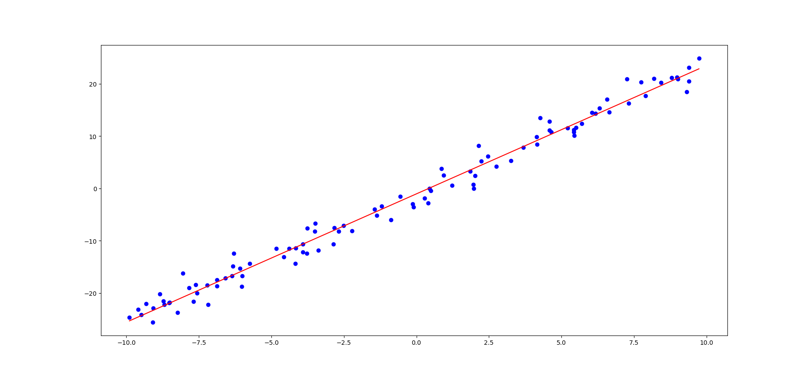
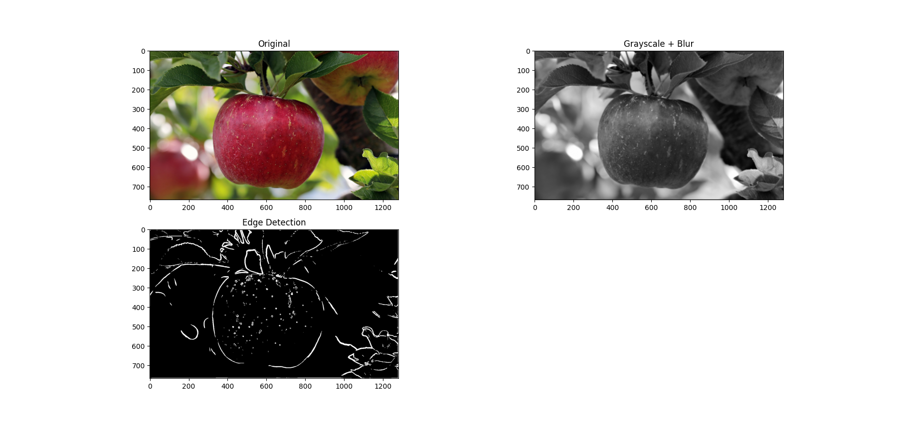

# Neural Network
The NN.py file contains a `NeuralNetwork` class that takes:  
- dataset inputs  
- dataset values  
- size of the output  
- number of hidden layers  
- number of neurons per each hidden layer (example = [128, 256, 128])  
- epochs  
- learning rate  

To train a model you must call the `train` function after initiating an instance of the class.  
A pre trained model with 3 hidden layers on the mnist dataset is also in the project folder with an accuracy of 99.81%.    
\* Be sure to save the file as an .npz file so you dont lose the model. (notebook is recommended)  
\* To evaluate new images with a trained model you can use the `forward_pass_hidden` function with some minor and simple tweaks

# K-means
The Kmeans.py file contains a `K_means` class that takes:
- features
- number of clusters
and finds the center of the classes.
To find the centroids, you should call the `train` function with desired epochs, and save the results in a numpy array. below are some examples
of the algorithm:

# Knn (K-Nearest Neighbors)
The KNN.py file contains a `KNearestNeighbors` class that takes:  
- features
- labels (values)  

Also to find the best k you can use the `train` function in the class that takes a list of k's as input
and finds the optimal k for the dataset.  
The input of the train function should be as such:  
[1,3,5,...]

\* The input of the class should be numpy arrays  

To predict the value of a feature you can use the `predict` function in the class. Which takes 2 inputs:
- the list of features
- k

Below is the output of the algorithm on the iris dataset:

| K Value | Accuracy |
|--------:|---------:|
| 1       | 96.00%   |
| 2       | 94.67%   |
| 3       | 96.00%   |
| 4       | 96.00%   |
| 5       | 96.67%   |
| 6       | 96.00%   |
| 7       | 96.67%   |
| 8       | 96.67%   |
| 9       | 96.67%   |
| 10      | 96.67%   |
| 11      | **97.33%** |
| 12      | 96.00%   |
| 13      | 96.67%   |
| 14      | 97.33%   |

**Best K = 11**

# Linear Regression
Using this algorithm is very simple, you should initiate the class with your dataset and labels and then you can `train` the model with your
desired learning rate and epoch.

If the number of features in your dataset is 1, you can see the result of the linear regression model alongside the data points using the `plot` function

# Edge detection
the edge_detection.py file conatains some function that do the task of edge detection.
## function explainations:
### Kernel:
used to generate gaussian kernel matrix that follow the formula below:
### $G(x, y) = \frac{1}{2\pi\sigma^2} \cdot e^{-\frac{x^2 + y^2}{2\sigma^2}}$

## Grayscale:
simply takes the values and uses certain weights to turn RGB into grayscale

## Blur:
uses the kernel function and blurs the image using convolution

## Sobel Filter:
uses the two matrices below to find parts of the image that have the biggest difference in value

$$ \begin{bmatrix} 
   -1 & 0 & 1 \\
   -2 & 0 & 2 \\
   -1 & 0 & 1 \\
   \end{bmatrix}       
 \begin{bmatrix} 
   -1 & -2 & -1 \\
    0 & 0 & 0 \\
    1 & 2 & 1 \\
   \end{bmatrix} $$

## finding_components:
finds all the closed loops in the filtered image

## area:
calculates the area of a given closed loop

## EdgeDetection:
uses the functions to find the biggest area in the image and returns it

